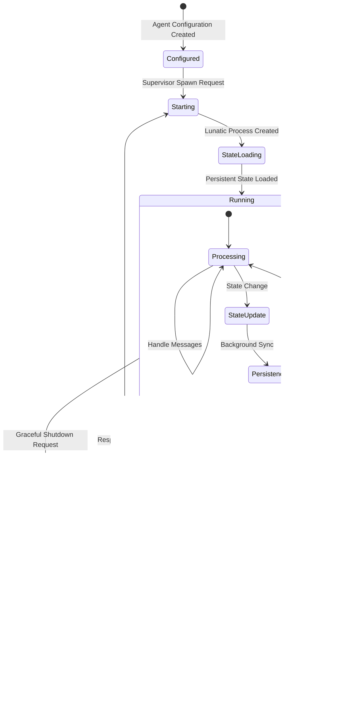

# System Architecture

## Overview

This project implements a scalable, robust framework for distributed, concurrent AI agents using:

**Rust**: for safe, high-performance agent logic and system code.

**WASM (WebAssembly)**: for secure, portable runtime environments for each agent.

**Lunatic**: an Erlang-inspired, actor-based runtime for orchestrating millions of lightweight, isolated WASM processes.

**NATS**: a high-performance, distributed messaging system with dual support for native TCP and WebSocket protocols, enabling both traditional server environments and WASM/browser deployments.

The design supports large-scale, fault-tolerant swarms of AI agents that can be orchestrated locally or across networks, with robust message passing, multi-target deployment capabilities, and easy extensibility for new agent behaviors, memory models, and deployment topologies.

## Key Concepts

### Agents
- Each agent is a Wasm process managed by Lunatic; implemented in idiomatic Rust.
- Agents are isolated ("no shared heap"), communicate only via asynchronous message-passing.
- Agents can be supervised and restarted by parent processes (Erlang "let it crash" philosophy).

### Supervisor
- Top-level controller responsible for spawning, monitoring, and restarting child agent processes.
- Implements agent pooling, task routing, health checking, and fault recovery.
- Uses Lunatic's supervisor trees for maximum reliability.

### Multi-Modal Communication
- **Lunatic Mailbox**: used for intra-node message passing (fast local channels between processes).
- **Native NATS (TCP)**: used for inter-node, inter-process, or remote/cloud agent messaging in server environments.
- **WebSocket NATS**: enables NATS messaging in WASM environments and browser deployments.
- **Subject-Based Routing**: supports pub/sub, queue groups, topic- and agent-based addressing.
- **Optional JetStream**: enables persistent event streams and message replay (planned).

### Memory & State
- **Ephemeral Context**: each agent maintains local state in its Wasm memory—fast, but volatile.
- **Long-Term/Persistent Context**: all important state is stored externally (database, key-value store, file system, or custom backends) via async-compatible APIs.
- **Dual-Layer Architecture**: automatic synchronization between ephemeral and persistent storage.
- Agents load relevant state on start/restart and never assume in-memory context will persist after failure or migration.

## Multi-Target Architecture

### Build Configurations

```mermaid
graph TB
    subgraph "Build Targets"
        subgraph "Native Builds"
            NATIVE[Native Development<br/>Full NATS TCP]
        end
        
        subgraph "WASM Builds"
            WASM_ONLY[WASM-Only<br/>Local Messaging]
            WASM_NATS[WASM + WebSocket NATS<br/>Distributed Messaging]
        end
    end
    
    subgraph "Feature Matrix"
        F1[default = nats]
        F2[wasm-only = []]
        F3[wasm-nats = websocket support]
        F4[nats = TCP client]
    end
    
    NATIVE --> F1
    NATIVE --> F4
    WASM_ONLY --> F2
    WASM_NATS --> F2
    WASM_NATS --> F3
    
    subgraph "Deployment Environments"
        ENV1[Server/Cloud<br/>Native Rust]
        ENV2[Lunatic Runtime<br/>Local WASM]
        ENV3[Browser/Edge<br/>WebSocket WASM]
    end
    
    NATIVE --> ENV1
    WASM_ONLY --> ENV2
    WASM_NATS --> ENV2
    WASM_NATS --> ENV3
```

## Recommended Practices
- Fail fast, retry safely: design supervisors to restart agents on error, restoring state from the persistent memory layer.
- Keep agents single-purpose: one agent = one main responsibility; chain/compose for complex workflows.
- Decouple via pub/sub: favor message-driven, decoupled logic for maximum resilience.
- Choose appropriate messaging: Lunatic mailboxes for local, NATS for distributed communication.
- Document all interfaces: schemas, expected message patterns, and storage contracts.

## Security Considerations
- Never expose internal NATS topics or agent APIs to untrusted networks.
- Use TLS for WebSocket NATS connections in production.
- Validate and sanitize all external message payloads.
- Never store secrets in code or unprotected config files.
- Leverage WASM sandboxing for agent isolation.

## High-Level System Architecture


## Build Configuration Matrix

### Feature Flags & Targets

| Configuration | Features | Target | Use Case | NATS Support |
|---------------|----------|--------|----------|--------------|
| **Native Development** | `--features nats` | `x86_64/aarch64` | Development, Testing | Full TCP NATS |
| **WASM Local** | `--features wasm-only` | `wasm32-wasip1` | Lunatic Runtime | Local messaging only |
| **WASM Distributed** | `--features "wasm-only,wasm-nats"` | `wasm32-wasip1` | Browser, Edge Computing | WebSocket NATS |
| **Production Native** | `--features nats --release` | `x86_64/aarch64` | Server Deployment | Full TCP NATS |

### Build Commands Reference

```bash
# Development builds
cargo build                                    # Native with full NATS
cargo run                                      # Demo application

# WASM builds  
cargo build --target=wasm32-wasip1 --no-default-features --features wasm-only
cargo build --target=wasm32-wasip1 --no-default-features --features "wasm-only,wasm-nats"

# Testing matrix
cargo test                                     # Native tests
cargo test --no-default-features --features wasm-only              # WASM-only
cargo test --no-default-features --features "wasm-only,wasm-nats"  # WASM+WebSocket

# Production builds
cargo build --release --features nats         # Native production
cargo build --release --target=wasm32-wasip1 --no-default-features --features "wasm-only,wasm-nats"
```

## Core Components

### 1. Agent System (`src/agent.rs`)

The Agent is the fundamental unit of computation in the system, with dual representations for flexibility.

#### Dual Agent Architecture
```rust
// Lightweight handle for external API
pub struct Agent {
    pub id: AgentId,
}

// Full agent state for process execution
pub struct AgentState {
    pub id: AgentId,
    pub ephemeral_state: HashMap<String, serde_json::Value>,
    pub persistent_backend: Box<dyn MemoryBackend>,
    pub nats: Option<NatsConnection>,
}
```

#### Message Processing Flow


### 2. Lunatic Supervisor System (`src/supervisor.rs`)

Implements the actor supervisor pattern using Lunatic's process management.

#### Supervisor Architecture


#### Supervisor API
```rust
// Spawn supervisor with multiple agent configurations
pub fn spawn_agent_supervisor(configs: Vec<AgentConfig>) -> Result<ProcessRef<AgentSupervisor>>;

// Spawn individual agent process
pub fn spawn_single_agent(config: AgentConfig) -> Result<ProcessRef<AgentProcess>>;

// Agent communication functions
pub fn send_message_to_agent(agent: &ProcessRef<AgentProcess>, message: Message);
pub fn send_state_action_to_agent(agent: &ProcessRef<AgentProcess>, action: StateAction);
pub fn get_agent_state(agent: &ProcessRef<AgentProcess>) -> HashMap<String, serde_json::Value>;
pub fn shutdown_agent(agent: &ProcessRef<AgentProcess>);
```

### 3. Dual NATS Communication Layer

#### 3.1 Native NATS (`src/nats_comm.rs`)

Built on the modern `async-nats` client providing full-featured messaging for server environments.


#### 3.2 WebSocket NATS (`src/wasm_nats.rs`)

WebSocket-based NATS client for WASM environments, maintaining protocol compatibility.


#### Communication Patterns Comparison

| Pattern | Native NATS | WebSocket NATS | Use Case |
|---------|-------------|----------------|----------|
| **Publish/Subscribe** | ✅ Full Support | ✅ Full Support | Event Broadcasting |
| **Request/Reply** | ✅ Native Support | 🔄 Planned | Synchronous Communication |
| **Queue Groups** | ✅ Native Support | 🔄 Planned | Load Balancing |
| **Streams** | ✅ JetStream Ready | 🔄 Future | Persistent Messaging |
| **Binary Protocol** | ✅ Direct TCP | ✅ WebSocket Frames | Protocol Efficiency |
| **Browser Support** | ❌ Not Available | ✅ Full Support | Client Applications |

### 4. Memory Subsystem (`src/memory.rs`)

Enhanced pluggable storage abstraction supporting multiple backends with automatic synchronization.

#### Memory Backend Architecture


#### Dual-Layer State Management


### 5. WebSocket Gateway Integration

For WASM deployments requiring NATS connectivity, a WebSocket gateway handles protocol translation.

#### Gateway Architecture Options

```mermaid
graph TB
    subgraph "WASM Client Environment"
        CLIENT[WASM Application<br/>with WebSocket NATS]
    end
    
    subgraph "Gateway Layer (Choose One)"
        subgraph "Option 1: Native NATS WebSocket"
            NATS_NATIVE[NATS Server v2.2+<br/>Built-in WebSocket Support]
        end
        
        subgraph "Option 2: Third-Party Gateway"
            THIRD_PARTY[nats-websocket-gw<br/>Protocol Translation]
        end
        
        subgraph "Option 3: Custom Gateway"
            CUSTOM[Custom Go/Rust Gateway<br/>TLS + Load Balancing]
        end
    end
    
    subgraph "NATS Infrastructure"
        NATS_CORE[NATS Server Core<br/>Subject Routing & Clustering]
    end
    
    CLIENT -.->|WebSocket (Binary)| NATS_NATIVE
    CLIENT -.->|WebSocket (Binary)| THIRD_PARTY
    CLIENT -.->|WebSocket (Binary)| CUSTOM
    
    NATS_NATIVE -.->|NATS Protocol| NATS_CORE
    THIRD_PARTY -.->|NATS Protocol| NATS_CORE
    CUSTOM -.->|NATS Protocol| NATS_CORE
```

## Data Flow Architectures

### 1. Multi-Configuration Message Flow


### 2. Fault-Tolerant Agent Lifecycle



### 3. Multi-Backend State Synchronization


## Deployment Patterns

### 1. Single-Node Development


### 2. Production Multi-Node Cluster


### 3. Hybrid Cloud-Edge Deployment


## Performance Characteristics & Optimizations

### 1. Performance Benchmarks

| Metric | Local Lunatic | Native NATS | WebSocket NATS | File Backend |
|--------|---------------|-------------|-----------------|--------------|
| **Latency (p50)** | <1ms | 2-5ms | 5-15ms | 10-50ms |
| **Latency (p99)** | 2ms | 10-20ms | 25-50ms | 100-200ms |
| **Throughput** | 100K+ ops/sec | 50K+ msgs/sec | 5K+ msgs/sec | 1K+ ops/sec |
| **Memory/Agent** | 1-5KB | 2-10KB | 5-15KB | 10-100KB |
| **CPU Usage** | Low | Medium | Medium-High | Medium |

### 2. Scalability Patterns


### 3. Optimization Strategies

#### Message Processing Optimization
```rust
// Batch message processing
impl Agent {
    async fn process_message_batch(&mut self, messages: Vec<Message>) -> Result<()> {
        // Group messages by type
        let mut state_updates = Vec::new();
        let mut business_logic = Vec::new();
        
        for msg in messages {
            match msg.payload.get("type") {
                Some("state") => state_updates.push(msg),
                _ => business_logic.push(msg),
            }
        }
        
        // Batch process state updates
        self.process_state_batch(state_updates).await?;
        
        // Process business logic concurrently
        let futures = business_logic.into_iter()
            .map(|msg| self.process_business_message(msg));
        futures::future::try_join_all(futures).await?;
        
        Ok(())
    }
}
```

## Security & Compliance

### 1. Security Layers


### 2. Compliance Features

| Requirement | Implementation | Status |
|-------------|----------------|--------|
| **Data Isolation** | WASM process sandboxing | ✅ Implemented |
| **Audit Logging** | Structured logging with serde | ✅ Implemented |
| **Access Control** | NATS subject-based permissions | 🔄 Configurable |
| **Encryption** | TLS for all network traffic | ✅ Implemented |
| **Key Rotation** | External key management integration | 🔄 Planned |
| **Compliance Reporting** | Metrics and audit trail export | 🔄 Planned |

## Future Enhancements & Roadmap

### Phase 1: Advanced Messaging (Q1-Q2)
- **JetStream Integration**: Persistent streams and message replay
- **Advanced WebSocket NATS**: Request/reply and queue group support
- **Message Compression**: Automatic compression for WebSocket transport
- **Connection Pooling**: Multi-connection support for high throughput

### Phase 2: Observability & Operations (Q2-Q3)
- **OpenTelemetry Integration**: Distributed tracing across agents
- **Prometheus Metrics**: Custom metrics collection and export
- **Health Checks**: Agent and system health monitoring
- **Configuration Management**: Dynamic configuration updates

### Phase 3: Production Features (Q3-Q4)
- **Agent Discovery**: Automatic service discovery via NATS
- **Load Balancing**: Intelligent request routing and agent placement
- **Multi-Tenancy**: Namespace isolation and resource quotas
- **Backup & Recovery**: State backup and point-in-time recovery

### Phase 4: Advanced Capabilities (Q4+)
- **Zero-Downtime Updates**: Rolling updates with state migration
- **Cross-Region Replication**: Multi-region state synchronization
- **AI/ML Integration**: Native support for AI model inference
- **Edge Computing**: Optimized builds for edge deployment

## Development Guidelines

### 1. Adding New Features

#### Multi-Target Compatibility Checklist
```rust
// Feature flag structure
#[cfg(feature = "nats")]          // Native NATS functionality
#[cfg(feature = "wasm-nats")]     // WebSocket NATS functionality  
#[cfg(not(feature = "nats"))]     // Stub implementations
#[cfg(target_arch = "wasm32")]    // WASM-specific code
#[cfg(not(target_arch = "wasm32"))] // Native-specific code
```

#### Agent Implementation Pattern
```rust
// 1. Define message types
#[derive(Serialize, Deserialize)]
pub struct CustomMessage {
    pub operation: String,
    pub data: serde_json::Value,
}

// 2. Implement message handler
impl Agent {
    pub async fn handle_custom_message(&mut self, msg: CustomMessage) -> Result<()> {
        match msg.operation.as_str() {
            "process" => self.process_data(msg.data).await,
            "store" => self.store_data(msg.data).await,
            _ => Err(Error::Custom("Unknown operation".to_string()))
        }
    }
}

// 3. Add NATS subject routing
const CUSTOM_SUBJECT: &str = "agents.custom.operations";

// 4. Add tests for all configurations
#[cfg(test)]
mod tests {
    #[test] fn test_native() { /* Native test */ }
    
    #[cfg(feature = "wasm-nats")]
    #[test] fn test_wasm_nats() { /* WASM+NATS test */ }
    
    #[cfg(not(feature = "nats"))]
    #[test] fn test_wasm_only() { /* WASM-only test */ }
}
```

### 2. Performance Testing Framework

```rust
#[cfg(test)]
mod benchmarks {
    use criterion::{criterion_main, criterion_group, Criterion};
    
    fn benchmark_agent_creation(c: &mut Criterion) {
        c.bench_function("agent_creation", |b| {
            b.iter(|| {
                // Benchmark agent creation across configurations
            });
        });
    }
    
    fn benchmark_message_throughput(c: &mut Criterion) {
        c.bench_function("message_throughput", |b| {
            b.iter(|| {
                // Benchmark message processing rates
            });
        });
    }
    
    criterion_group!(benches, benchmark_agent_creation, benchmark_message_throughput);
    criterion_main!(benches);
}
```

### 3. Documentation Standards

Every new feature must include:
- **API Documentation**: Comprehensive rustdoc with examples
- **Configuration Guide**: Feature flags and environment variables
- **Performance Impact**: Benchmarks and resource usage
- **Migration Guide**: Changes required for existing code
- **Security Considerations**: Security implications and mitigations

This architecture provides a comprehensive foundation for building scalable, distributed agent-based systems with support for multiple deployment targets, robust fault tolerance, and extensive messaging capabilities across native and WebAssembly environments.